<div align="center">

# 🌸 PitchCraft AI 📈

**Automated multi-agent workflow for institutional-grade pitch books**

</div>

<p align="center">
  <a href="#-overview">Overview</a> •
  <a href="#-architecture">Architecture</a> •
  <a href="#-agent-roster">Agents</a> •
  <a href="#-setup">Setup</a> •
  <a href="#-usage">Usage</a> •
  <a href="#-sample-output">Sample Output</a>
</p>

<p align="center">
  
  
  
</p>

---

## 🎯 Overview

PitchCraft AI transforms a single company request into a fully formatted investment memorandum. The root `Pitch_book_agent` coordinates a deterministic sequence of Gemini-powered sub-agents, ensuring the user only receives the final document. The workflow adheres to strict governance: every tool call is ordered, every intermediate output is validated, and the orchestrator remains silent until the report is complete.

**Core capabilities**
- Automated data ingestion from market feeds and financial databases.
- Standardized narrative generation covering rationale, risks, and business profile.
- Report assembly with consistent formatting suitable for investor communications.
- Built on the Google Agent Developer Kit (ADK) and Gemini 2.5 family.

---

## 🧠 Architecture

```mermaid
graph TD
    style User fill:#f5f5f5,stroke:#333,color:#000
    style Manager fill:#dcd6f7,stroke:#333,color:#000
    style Data fill:#d0ece7,stroke:#333,color:#000
    style Analysis fill:#fdebd0,stroke:#333,color:#000
    style Assembly fill:#fadbd8,stroke:#333,color:#000
    style Report fill:#d5f5e3,stroke:#333,color:#000

    User(👤 Request) --> Manager(🎩 Pitch_book_agent)

    subgraph "Phase 1 · Data Acquisition"
        Manager --> Data1(📡 DMIS_Agent)
        Manager --> Data2(📊 FMPS_Agent)
    end

    subgraph "Phase 2 · Narrative Generation"
        Data1 -- Market data --> Analysis(✍️ CGNS_Agent)
        Data2 -- Financials --> Analysis
    end

    subgraph "Phase 3 · Report Assembly"
        Analysis -- Narrative --> Assembly(📑 DVS_Agent)
        Data1 -- Structured data --> Assembly
        Data2 -- Structured data --> Assembly
    end

    Assembly --> Report(✅ Final Report)
```



Execution safeguards:
1. Company/ticker extraction and validation.
2. Parallel data retrieval with strict JSON contracts.
3. Narrative synthesis using only sanctioned inputs.
4. Template population and formatting.
5. Single final response to the user.

---

## 🤖 Agent Roster

| Agent | Role | Responsibilities |
| --- | --- | --- |
| 🟣 **Pitch_book_agent** | Orchestrator | Sole user-facing agent. Manages sequencing, enforces silence, and returns the completed report. |
| 📡 **DMIS_Agent** | Market data collector | Pulls news flow and live market metrics, returning normalized JSON. |
| 📊 **FMPS_Agent** | Fundamental data collector | Provides historical financials, valuation ratios, technical indicators, and analyst consensus. |
| ✍️ **CGNS_Agent** | Narrative analyst | Synthesizes investment rationale, risk commentary, and thematic overview from structured inputs. |
| 📑 **DVS_Agent** | Report assembler | Merges narrative and metrics into the final presentation-ready layout. |

Each agent is exposed through an `AgentTool`, allowing the root agent to call them deterministically while preserving ADK traceability.

---

## ⚙️ Setup

1. **Clone**
   ```bash
   git clone <your-fork-url>
   cd Pitch-book-agent-by-adk-
   ```

2. **Environment**
   ```bash
   python -m venv .venv
   source .venv/bin/activate            # Windows: .venv\Scripts\activate
   pip install -r requirements.txt      # or install google-adk + google-genai manually
   ```

3. **Configuration**
   - Create a `.env` file (e.g., `vim .env`) and provide:
     ```
     GOOGLE_APPLICATION_CREDENTIALS=/path/to/service-account.json
     PROJECT_ID=your-project
     LOCATION=global
     ```
   - Load the environment:
     ```bash
     source .env
     ```

4. **Permissions**
   - Service account must access Vertex AI, Discovery Engine (if used for upstream data), and any external data sources invoked by the tools.

---

## ▶️ Usage

Run the orchestrator directly:
```bash
python -m Pitch_book_agent.agent "Apple Inc., NASDAQ"
```

Use the retry helper if you expect transient quota limits:
```python
from Pitch_book_agent.agent import root_agent, run_with_retry
print(run_with_retry(root_agent, "AAPL, NASDAQ"))
```

Runtime behavior:
1. CLI prompts for a company or ticker with exchange.
2. Root agent executes all sub-agent calls silently.
3. Final report is emitted after DVS_Agent returns formatted output.

Logs or telemetry can be added around the `run_with_retry` helper to audit end-to-end execution.

---

## 📄 Sample Output

The following excerpt is from an Apple Inc. (AAPL) run. The full report includes disclosures, business description, valuation tables, technical indicators, and consensus view.

<details>
<summary><strong>View sample</strong></summary>

```
[user]: apple company NASDAQ
[Pitch_book_agent]: AAPL:US
17-Jul-25

Disclosures and Disclaimer
· XXXXXX
· XXXXXX
· XXXXXX

Investment Rationale and Risks
...
```

</details>

---

## 🛤 Roadmap
1. Export to presentation formats (PowerPoint / PDF slides) with company branding.
2. Introduce multilingual templates for regional pitch books.
3. Add secure streaming of intermediate statuses for compliance teams without exposing user-facing chatter.

---

## 📫 Support

Please open an issue for bug reports, enhancement ideas, or integration questions. Contributions and peer reviews are welcome.
