# 🤖 PitchCraft AI 📈

**Automated Pitch Book & Investment Report Generator**

  <a href="#-about-the-project">About</a> •
  <a href="#-how-it-works">Workflow</a> •
  <a href="#-example-output">Live Demo</a> •
  <a href="#-the-agent-team">The Agents</a> •
  <a href="#-getting-started">Getting Started</a>

    
    
    

---

## 🎯 About The Project

> PitchCraft AI is a sophisticated multi-agent system designed to fully automate the creation of comprehensive pitch books and investment reports. It orchestrates a team of specialized AI agents, transforming raw financial data and user requests into a polished, professional, and data-driven document with zero manual intervention.

### ✨ Key Features:

-   **Fully Automated**: From initial request to final report delivery, the process is hands-off.
-   **Modular by Design**: Each agent has a single, well-defined responsibility, making the system robust and easy to extend.
-   **Data-Driven**: Integrates with live financial data sources to provide up-to-date analysis.
-   **Consistent & Professional**: Ensures all reports are generated in a standardized, high-quality format.

---

## ⚙️ How It Works

The system is managed by a root **`Pitch_book_agent`** which acts as a project manager. It directs a sequence of specialized sub-agents to gather data, perform analysis, and assemble the final report.

```mermaid
graph TD
    style User fill:#5DADE2,stroke:#333,stroke-width:2px,color:#fff
    style Manager fill:#8E44AD,stroke:#333,stroke-width:2px,color:#fff
    style Data fill:#1ABC9C,stroke:#333,stroke-width:2px,color:#fff
    style Analysis fill:#F39C12,stroke:#333,stroke-width:2px,color:#fff
    style Assembly fill:#E74C3C,stroke:#333,stroke-width:2px,color:#fff
    style Report fill:#2ECC71,stroke:#333,stroke-width:2px,color:#fff

    User(👤 User Request) --> Manager(🤖 Pitch_book_agent);

    subgraph "Phase 1: Data Gathering"
        Manager --> Data1(📡 DMIS_Agent);
        Manager --> Data2(📊 FMPS_Agent);
    end

    subgraph "Phase 2: Analysis & Narrative"
        Data1 -- News & Market Data --> Analysis(✍️ CGNS_Agent);
        Data2 -- Quantitative Data --> Analysis;
    end
    
    subgraph "Phase 3: Final Assembly"
        Analysis -- Investment Summary --> Assembly(📑 DVS_Agent);
        Data1 -- Raw Data --> Assembly;
        Data2 -- Raw Data --> Assembly;
    end

    Assembly --> Report(✅ Final Report.pdf);

    classDef default font-family: 'Helvetica', sans-serif;
```

📄 Example Output

Here is a sample report generated by the agent system for the prompt apple company NASDAQ.

 
<strong>🚀 Click to see the full generated report for Apple Inc. (AAPL)</strong>

[user]: apple company NASDAQ
[Pitch_book_agent]: AAPL:US
17-Jul-25

Disclosures and Disclaimer
· XXXXXX
· XXXXXX
· XXXXXX

Investment Rationale and Risks
Investment Rationale:
· Apple benefits from a deeply integrated ecosystem of hardware, software, and services, fostering strong brand loyalty and high customer retention that supports consistent revenue generation.
· The company continues to innovate with a planned significant new product lineup for the first half of 2026, including new iPhone, iPad, and Mac models, providing a clear future growth pipeline.
· Strategic investments, such as the $500 million deal with MP Materials for U.S.-made recycled rare earth magnets, enhance supply chain resilience and reduce geopolitical dependence.
· Despite market fluctuations, Apple demonstrates robust financial health with high profitability and consistent shareholder returns through dividends and share buybacks.

Investment Risks:
· Apple faces significant competitive pressure and challenges in its Artificial Intelligence strategy, with recent departures of key AI talent highlighting potential gaps in its competitive positioning and execution.
· A looming management overhaul, including the chief operating officer transition and several senior executives nearing retirement, introduces uncertainty regarding long-term strategic direction and leadership stability.
· Market saturation in its core product categories and increasing competition from other tech giants could lead to slower growth rates if new revenue streams or product categories do not materialize as expected.
· The company is exposed to increased regulatory scrutiny across various jurisdictions, particularly concerning app store policies and market dominance, which could impact business models and profitability.

Investment Theme/ Business Description
Theme: Consumer Electronics/Software/Services/Artificial Intelligence/Supply Chain

Business description: Apple Inc. designs, manufactures, and markets smartphones, personal computers, tablets, wearables, and accessories worldwide. The company also sells a range of related services, creating an integrated ecosystem for its customers.
Company Facts ²⁾
Bloomberg Ticker: AAPL:US
Currency: USD
Bloomberg Country of Risk: United States
ISIN: US0378331005
Sector (GICS): Information Technology
Industry (GICS): Consumer Electronics
Market Capitalization (USDm): 3,120,000
Expected Next Earnings Report Date: 31-Jul-25

Historical Share Price Data/ Technical Indicators ²⁾
Last Price: 209.11
52 Week High / Low: 260.1 / 169.21
Percentage Price Change - 1 Year (%): +-4.39
Moving Average 20 Day: 205.42
Moving Average 50 Day: 203.78
Moving Average 200 Day: 222.63
Bollinger Bands - Upper/Lower: 224.64 / 195.54
Relative Strength Index (RSI) 14 Day: 55.85

Financial Matrix ²⁾
PE - Current Year / Next Fiscal Year: 32.56 / 28.83
Estimated PE Growth Rate (x): 1.95
Price/Book ratio (x): 46.77
Dividend Yield % - Indicated / Nxt Yr Est.: 0.48 / 0.5
3 Year Dividend Growth (%): 5.13
Free Cash Flow Yield (%) - Trailing/Forward: 3.14 / N/A
Shareholder Yield (Returned Capital/Market Cap)%: 4.1
Enterprise Value/ This Year Estimated EBITDA: 22.35
Return on Common Equity (%): 138.0
Net Debt/ Equity (%): 147.0
Equity Beta (x): 1.12

Bloomberg Consensus ²⁾
No of Buys / Holds / Sells: 21 / 11 / 2
Consensus 12m Target Price: 235.27
Return Potential (%): +12.51%

Note:XXX
XXX
XXX

🤝 The Agent Team
Our system is composed of a powerful team of agents, each an expert in its domain.

🟣 Pitch_book_agent (The Conductor)
Role: Root Agent / Project Manager

Function: This agent acts as a silent project manager, strictly orchestrating the sequence of sub-agents. It handles the initial user request and delivers only the final, completed document without any intermediate conversation.

✍️ CGNS_Agent (The Analyst)
Role: Sub Agent / Equity Research Analyst

Function: This agent analyzes pre-fed financial data and news to generate a structured investment summary. It is responsible for creating the core narrative, including the investment rationale and key risks, in a strict format for the next step.

📡 DMIS_Agent (The News Scout)
Role: Sub Agent / Data Retrieval Specialist

Function: This agent gathers the latest market data and recent news about a company from trusted financial sources. Its sole output is to structure this raw, unbiased information into a strict JSON format for other agents to analyze.

📊 FMPS_Agent (The Quant)
Role: Sub Agent / Financial Data Fetcher

Function: This agent collects a comprehensive set of quantitative financial data, from technical indicators to analyst ratings. Its only function is to structure this raw information into a strict JSON object for use by other agents, without performing any analysis.

📑 DVS_Agent (The Assembler)
Role: Sub Agent / Document Finalizer

Function: This is the final agent in the chain. It meticulously combines the pre-written narrative from the Analyst and the raw data from the Scouts into a single, strictly formatted report. It performs no analysis, simply populating a pre-defined template to create the final document.

Get start: rmb to set up your environment by .env file for [vim .env] in your terminal!!

