<div align="center">

# 🌸 PitchCraft AI 📈

**A charming multi-agent studio for instant pitch books & investment reports**

</div>

<p align="center">
  <a href="#-project-sparkle">About</a> •
  <a href="#-workflow">Workflow</a> •
  <a href="#-agent-lineup">Agents</a> •
  <a href="#-getting-started">Getting Started</a> •
  <a href="#-example-output">Sample Report</a>
</p>

<p align="center">
  
  
  
</p>

---

## 🎯 Project Sparkle
**PitchCraft AI** is a delightful yet professional multi-agent pipeline that turns a company name into a fully formatted pitch book. The root agent quietly coordinates a squad of specialists—market scouts, data quants, storytellers, and layout artists—so the user only sees the polished final report.

### ✨ Why you'll love it
- **End-to-end automation** – ask once, receive the finished document.
- **Modular architecture** – swap or extend agents without touching the orchestration logic.
- **Consistent format** – every report ships with the same high-quality template.
- **Cloud native** – powered by Google’s Agent Developer Kit and Gemini models.

---

## 🧠 Workflow
The `Pitch_book_agent` orchestrates the whole show in five silent steps: extract the ticker → gather data → analyze → format → reveal the final PDF/text.

```mermaid
graph TD
    style User fill:#F8BBD0,stroke:#333,color:#111
    style Manager fill:#C39BD3,stroke:#333,color:#111
    style Data fill:#A2D9CE,stroke:#333,color:#111
    style Analysis fill:#FAD7A0,stroke:#333,color:#111
    style Assembly fill:#F5B7B1,stroke:#333,color:#111
    style Report fill:#ABEBC6,stroke:#333,color:#111

    User(👤 User prompt) --> Manager(🎩 Pitch_book_agent)

    subgraph "Phase 1 · Data Gathering"
        Manager --> Data1(📡 DMIS_Agent)
        Manager --> Data2(📊 FMPS_Agent)
    end

    subgraph "Phase 2 · Narrative Crafting"
        Data1 -- news & pulse --> Analysis(✍️ CGNS_Agent)
        Data2 -- financials --> Analysis
    end

    subgraph "Phase 3 · Dress Rehearsal"
        Analysis -- storyline --> Assembly(📑 DVS_Agent)
        Data1 -- raw data --> Assembly
        Data2 -- raw data --> Assembly
    end

    Assembly --> Report(✅ Final report)
```



---

## 🤖 Agent Lineup

| Agent | Personality | Superpower |
| --- | --- | --- |
| 🟣 **Pitch_book_agent** | The conductor | Extracts the target company, strictly enforces the call order, and stays silent until the grand reveal. |
| 📡 **DMIS_Agent** | News scout | Fetches market data + headlines, packages them into tidy JSON. |
| 📊 **FMPS_Agent** | The quant | Supplies historical fundamentals, valuation ratios, consensus targets, and technical indicators. |
| ✍️ **CGNS_Agent** | Story crafter | Builds investment rationale & risk narratives from the structured data. |
| 📑 **DVS_Agent** | Layout artist | Weaves narrative + metrics into the final pitch deck section. |

---

## 🚀 Getting Started

### 1. Clone & peek inside
```bash
git clone <your-fork-url>
cd Pitch-book-agent-by-adk-
```

### 2. Create a comfy Python space
```bash
python -m venv .venv
source .venv/bin/activate   # Windows: .venv\Scripts\activate
pip install -r requirements.txt  # or install google-adk + deps manually
```

### 3. Add your secrets to `.env`
Create a `.env` file (or edit with `vim .env`) containing the credentials/keys needed by the ADK + Gemini stack, for example:
```
GOOGLE_APPLICATION_CREDENTIALS=/path/to/service-account.json
PROJECT_ID=your-project
LOCATION=global
```
Load it before running:
```bash
source .env
```

### 4. Run the maestro
```bash
python -m Pitch_book_agent.agent "Apple Inc., NASDAQ"
```
The orchestrator will remain silent until every sub-agent finishes, then print the full report.

> 💡 Tip: Need retries for busy APIs? Call `run_with_retry(root_agent, "AAPL, NASDAQ")` and let the helper handle quota hiccups.

---

## 📄 Example Output
The snippet below comes from a live run for **Apple Inc. (AAPL)**. The report includes disclosures, investment rationale vs. risks, business snapshot, technical stats, valuation metrics, and analyst consensus in a crisp sell-side style.

<details>
<summary><strong>✨ View sample output</strong></summary>

```
[user]: apple company NASDAQ
[Pitch_book_agent]: AAPL:US
17-Jul-25

Disclosures and Disclaimer
· XXXXXX
· XXXXXX
· XXXXXX

Investment Rationale and Risks
...
```

</details>

---

## 🛠 Roadmap
1. Export ready-made PowerPoint/Keynote slides.
2. Add multilingual templates.
3. Stream intermediate progress via secure channels (still keeping user interface serene).

---

## 💌 Need a hand?
Open an issue or drop a note—PitchCraft loves feedback and new ideas. Happy pitching! 🎀
